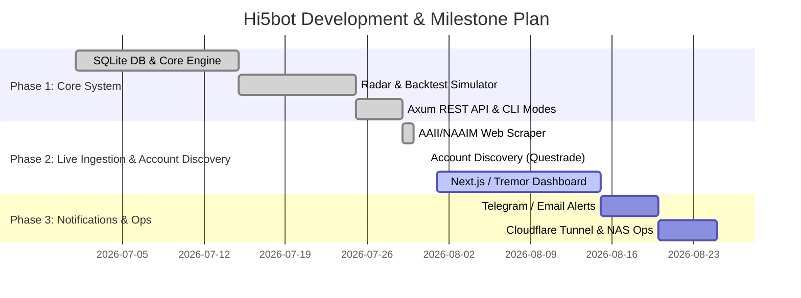

# Development Plan & Milestone Tracker (plan.md)

> **Last updated**: 2026-07-31 — M4 fetcher implemented behind feature gate; test count updated.

## 1. Executive Roadmap & Status

Overall System Completion: **Phase 1 & Core Phase 2 Complete (62/62 Tests Passing)**. Next phases focus on Frontend Dashboard development, Alert Channels, and Cloudflare Tunnel integration.

---

## 2. Milestone Breakdown & Deliverables

### Milestone 1: Core Daemon & Financial Storage Layer [COMPLETED ✅]
* **Unit M1.1**: Implemented `src/db.rs` SQLite layer (`market_signals`, `order_log`, `backtest_cache` tables) using WAL mode (~290 lines).
* **Unit M1.2**: Questrade OAuth2 refresh token rotation & atomic storage in `src/auth.rs`.
* **Unit M1.3**: Buffer pool integer share allocation flooring and invariant validation in `src/buffer_pool.rs`.

### Milestone 2: Market Extreme Radar & Backtest Laboratory [COMPLETED ✅]
* **Unit M2.1**: Implemented 3-Pillar Market Sentiment & Breadth classification in `src/radar.rs` (~230 lines).
* **Unit M2.2**: Implemented Hi5 vs Hi5e historical simulator calculating CAGR, MaxDD (from NAV), and Sharpe Ratio in `src/backtest.rs` (~530 lines).
* **Unit M2.3**: Built cache layer for storing backtest simulation runs in SQLite.

### Milestone 3: Axum REST API & Multi-Mode CLI [COMPLETED ✅]
* **Unit M3.1**: Implemented Axum Web API with 8 REST endpoints in `src/web.rs` (~290 lines).
* **Unit M3.2**: Extended `Cargo.toml`, `src/main.rs` with `--web-only`, `--once`, `--dry-run` CLI modes.
* **Unit M3.3**: Configured `docker-compose.yml` with port 8080 binding and `HI5BOT_BIND` environment configuration.

---

### Milestone 4: Data Ingestion & Account Discovery [COMPLETED ✅]
* **Unit M4.1**: Implemented `src/fetcher.rs` with `reqwest` + `scraper` (gated behind `web-scraper` Cargo feature) to fetch AAII Sentiment Survey and NAAIM Exposure Index. Returns `None` on scrape failure to avoid false signals.
* **Unit M4.2**: Engine tick (`src/engine.rs`) calls `fetch_market_sentiment()` and persists results to `market_signals` table.
* **Unit M4.3**: Live engine reads `latest_market_signal` from DB and applies `hi5e_dynamic_budget()` zone multiplier.
* **Unit M4.4**: Implemented `src/accounts.rs` — Questrade API-driven account discovery at startup. Filters by `account_types` whitelist, locks in active accounts. Replaced hardcoded `resp_account`/`tfsa_account` fields.
* **Unit M4.5**: Order logging to SQLite on every buy/sell execution with `status: "submitted"`.
* **Unit M4.6**: Implemented `fetch_sp500_breadth()` in `src/fetcher.rs` — S&P 500 % above 200MA Market Breadth fetcher via Yahoo Finance chart API (`^S5TW`).

### Milestone 5: Web Frontend Dashboard (`web/`) [PLANNED ⏳]
* **Unit M5.1**: Initialize Next.js + TailwindCSS + Tremor/Chart.js project in `web/` directory.
* **Unit M5.2**: Build Real-time Radar Gauge and Extreme Zone indicator widget.
* **Unit M5.3**: Build Portfolio Target vs Actual allocation donut charts.
* **Unit M5.4**: Build Hi5 vs Hi5e Backtest Comparison interactive graph.

### Milestone 6: Multi-channel Alerting & Cloudflare Tunnel [PLANNED ⏳]
* **Unit M6.1**: Implement Telegram Bot / Webhook alerts in `src/notify.rs` for order execution notifications and circuit breaker trips.
* **Unit M6.2**: Add `cloudflared` container service to `docker-compose.yml` for secure zero-trust remote access.
